# Artcode Canvas

**Artcode Canvas** 是一个旨在通过结合艺术效果与编程教学，带领初学者以轻松愉快的方式入门JavaScript编程和算法艺术创作的项目。用户可以参与我们的算法艺术课程，从零开始绘制属于自己的作品，并且跟随通俗易懂的教程完成解数独、编写球和板小游戏等实战项目。为了吸引用户兴趣，降低初学者的“畏难”心理，我们非常重视网页的交互性和反馈的实时性，提供了相当多的动画效果以及可以动手操作并查看效果的代码编辑器与画布界面。

本项目是2023级ECNU计算机拔尖班《设计思维》课程“学习机器学习机器学习”小组的结课作业。（如果您是教师，可以在上传的作业文件中找到作者的姓名学号等信息）

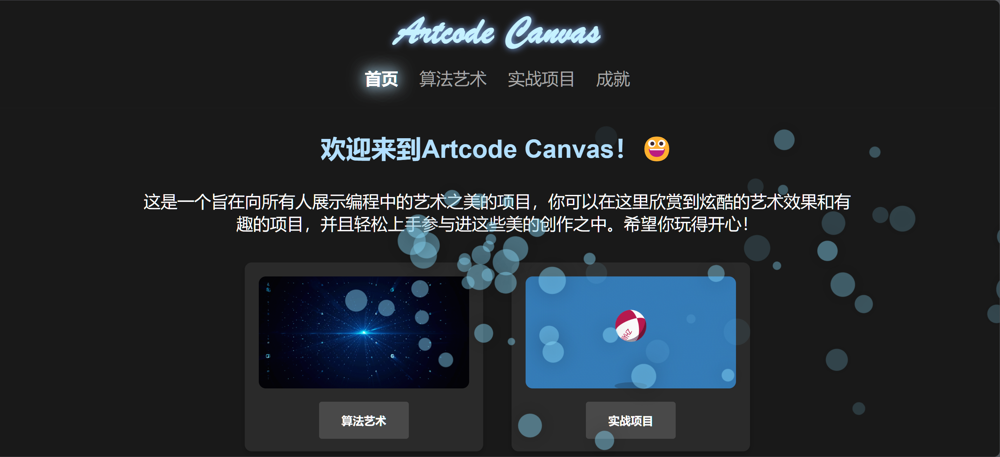

## 项目亮点

- **互动性强**：提供了实时代码编辑器与画布，用户可以立即看到自己修改代码后的效果，增强了学习的趣味性和成就感。
- **引导式学习**：通过循序渐进的教程与提示，帮助初学者逐步掌握编程基础和项目开发技能，避免了学习过程中的困惑和挫败感。
- **艺术与编程的结合**：将编程与艺术创作相结合，用户不仅可以学习编程，还能创造出美丽的视觉效果，让学习变得更加生动有趣。
- **多样化项目**：提供了解数独和编写球和板小游戏等实战项目，结合算法艺术，让用户在动手实践中巩固所学知识。
- **成就系统**：对于算法艺术课程中的每一课，无论学习者是在阅读教程后独立完成任务，还是需要提示、答案的帮助，都可以获得对应的成就星星，成就系统有助于记录学习进度、提升学习动力

## 页面介绍

### 1. 算法艺术

**算法艺术**课程旨在通过十节以**交互式页面**为教学方式的课程，引导用户从声明变量、数据类型等基础概念入手，最终完成canvas操作、交互事件等技能，绘制出属于自己的算法艺术作品。

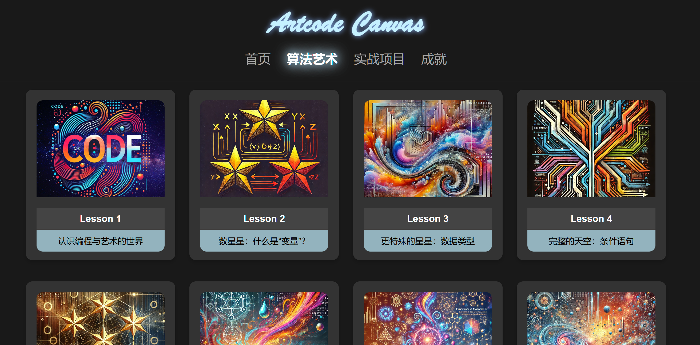

在第一课中，界面右边是一个可以实时修改，并且准备了注释详尽的原始代码的编辑器界面，用户无需掌握任何编程技能，只需要根据提示修改部分代码，观察自己的改动对艺术效果带来的改变。

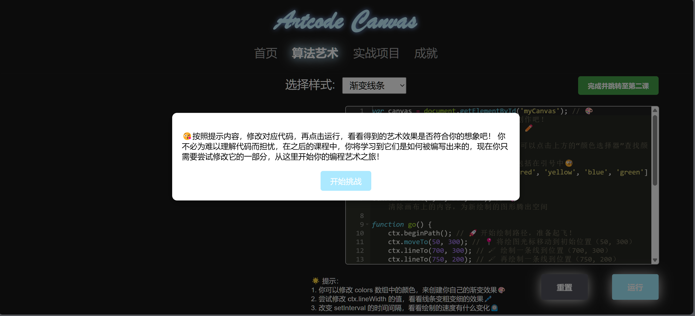
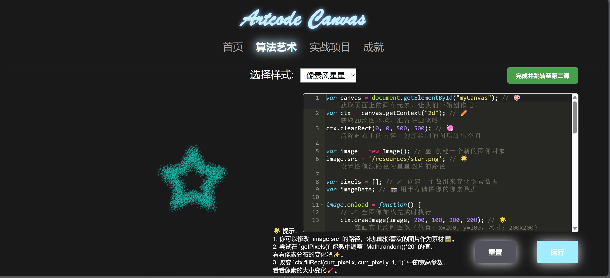

在接下来的课程中，用户可以根据教程尝试学习相应编程知识，尝试完成任务并获取成就星星。如果在学习过程中遇到困难，我们也准备了详尽的提示与答案文件，可以作为学习资料。

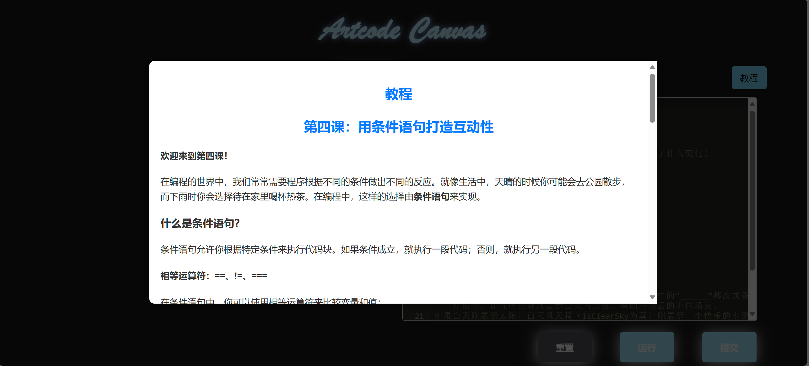
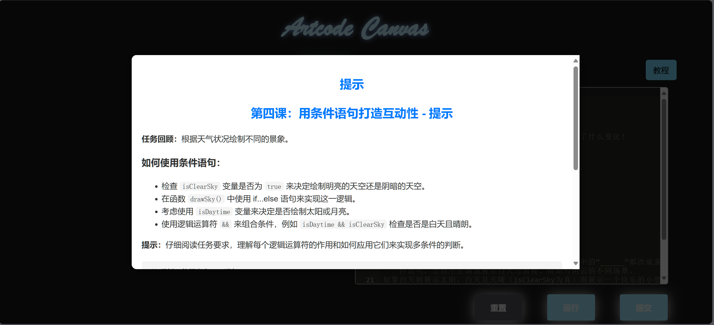
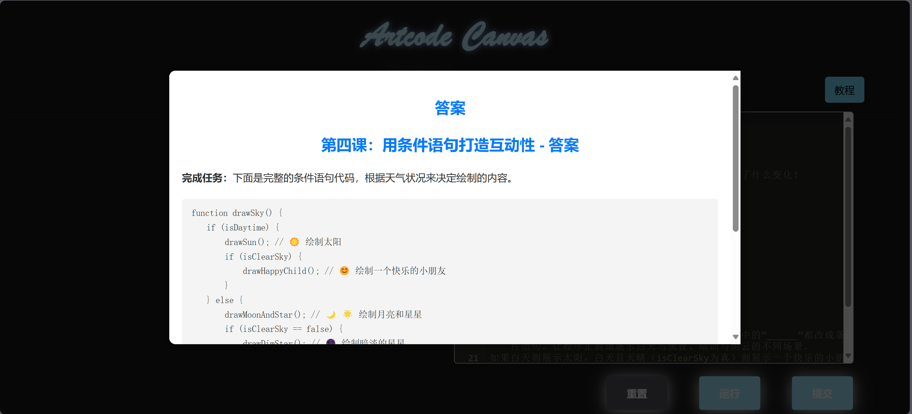
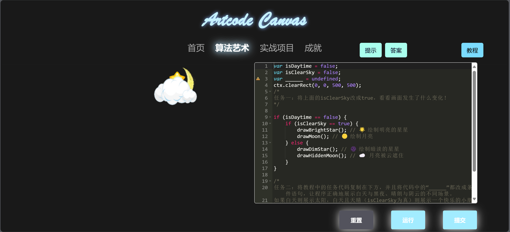

如果顺利完成任务并点击“提交”键，用户将看到祝贺与总结页面，并被鼓励继续完成接下来的课程

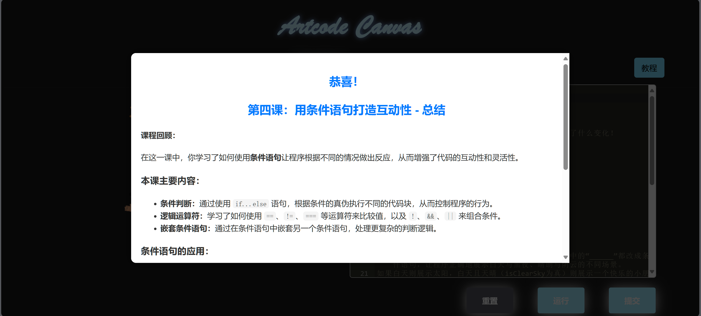

我们目前已完成了第1~5课的开发。

### 2. 实战项目

**实战项目**页面为用户提供了多个循序渐进的小型项目，包括解数独和球与板小游戏。每个项目都有详细的步骤说明和可编辑的代码区域，用户可以在完成项目的过程中学习和实践编程技能。这些项目通过实践操作，帮助用户巩固基础知识，并提升解决实际问题的能力。

在“解数独”这个实战项目中，由于初学者往往对递归回溯这个概念感到难以理解，所以我们在标程代码的基础上编写了动画，可以实时展现这一代码解答数独的过程。如果用户仍然感到不理解，也可以阅读右侧的示例代码。我们为示例提供了详细的注释，可以降低学习难度。

在“球和板游戏“这个项目中，我们仍然提供了通俗生动的教程和示例代码，同时还将一个窗口以展示用户代码执行后所得到的游戏效果。

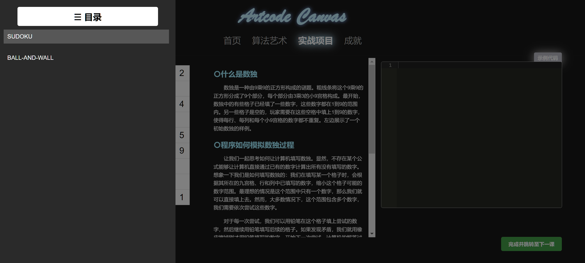
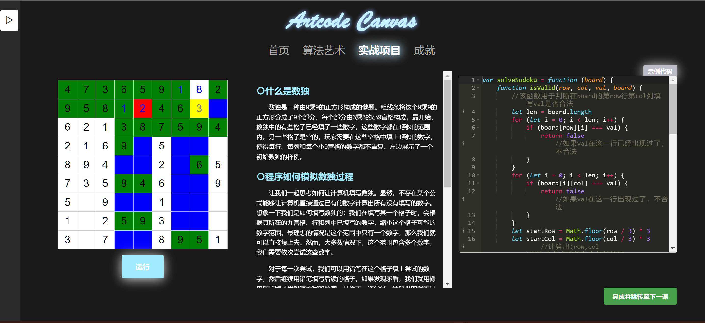
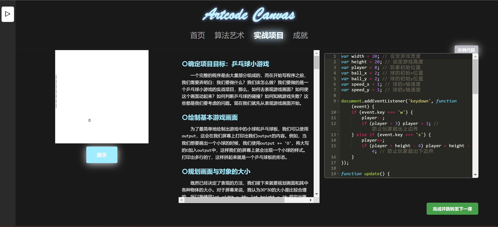

### 3. 成就

**成就页**记录了用户在Artcode Canvas中的学习和实践过程中的各种成就。随着用户完成各个章节的任务，成就页会动态展示用户的进度和已获得的成就星星。这个页面的设计旨在激励用户不断挑战自我，完成更多的学习目标。

## 结语
Artcode Canvas 的设计目的是让学习编程成为一种有趣而有益的体验。通过交互式的学习方式和丰富的实践内容，我们希望每一位用户都能在这里找到属于自己的编程乐趣！
